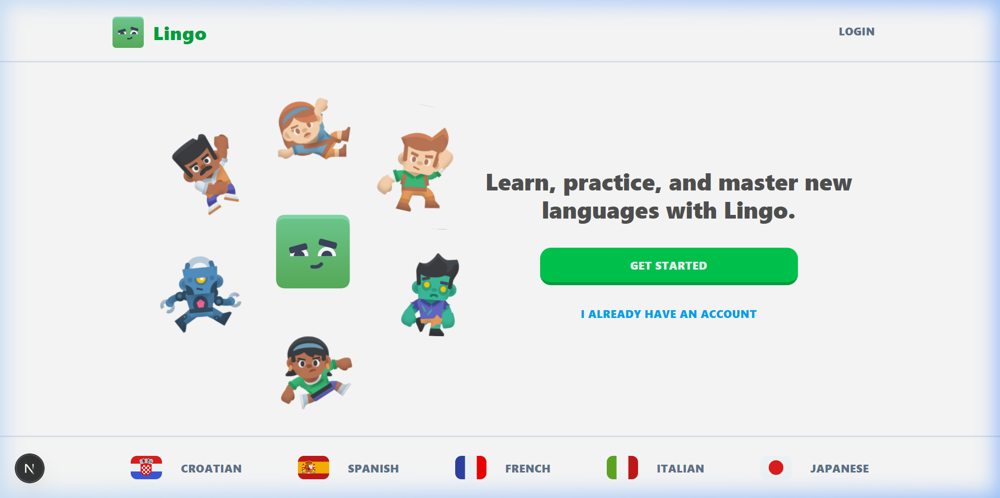
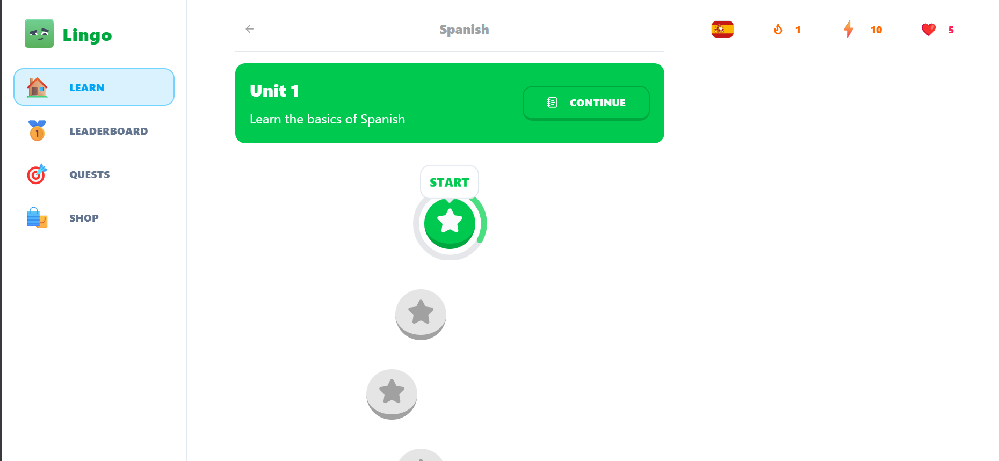

# Lingo - A Beautiful Duolingo Clone

Lingo is a feature-rich, gamified language learning platform built with modern web technologies. It provides an engaging and interactive experience for mastering new languages through a series of structured lessons, challenges, and competitive leaderboards.



## 🌟 Features

### 🎮 Gamified Learning
- **Heart System**: Manage your mistakes with a replenishing heart system. Lose hearts for wrong answers, and earn them back over time or through the shop.
- **Experience Points (XP)**: Earn points for every successful challenge and lesson completion.
- **Daily Streaks**: Stay consistent with a streak system that tracks your consecutive learning days. 🔥
- **Quests**: Reach point milestones to complete daily quests. 🎯

### 🌍 Diverse Courses
- Learn **Spanish**, **French**, **Italian**, or **Croatian**.
- Each course features multiple units and categorized lessons (Nouns, Verbs, Greetings, etc.).

### 🏆 Competition
- **Leaderboard**: See how you rank against other learners in the global top 10.
- **Active Community**: View other learners' progress and images.

### 💎 Shop
- Use your earned points to refill your hearts.
- Placeholder for "Unlimited Hearts" (Pro feature simulation).

---

## 🚀 Quick Setup

### 1. Prerequisites
- **Node.js** (v18 or later)
- **PostgreSQL** (Neon.tech recommended)
- **Clerk Account** (for authentication)

### 2. Installation
```bash
npm install
```

### 3. Environment Variables
Create a `.env.local` file in the root directory:
```env
NEXT_PUBLIC_CLERK_PUBLISHABLE_KEY=...
CLERK_SECRET_KEY=...
DATABASE_URL=...
```

### 4. Database Setup
```bash
npx drizzle-kit push
npm run db:seed
```

### 5. Start the App
```bash
npm run dev
```

---

## 🛠️ Tech Stack

- **Framework**: [Next.js 14](https://nextjs.org/) (App Router, Server Actions)
- **Database**: [PostgreSQL](https://www.postgresql.org/) with [Drizzle ORM](https://orm.drizzle.team/)
- **Auth**: [Clerk](https://clerk.com/)
- **Styling**: [Tailwind CSS](https://tailwindcss.com/)
- **Components**: [shadcn/ui](https://ui.shadcn.com/)
- **Icons**: [Lucide React](https://lucide.dev/)
- **Animations**: [Framer Motion](https://www.framer.com/motion/) & [Canvas-Confetti](https://www.npmjs.com/package/canvas-confetti)

---

## 📸 Application Preview

### Course Selection
Choose from a variety of languages with beautiful, high-quality illustrations.


### Engaging Lessons
Interactive select and assist challenges with real-time feedback and mascot guidance.

---

## 🙌 Credits
Designed and developed with a focus on visual excellence and premium user experience.
